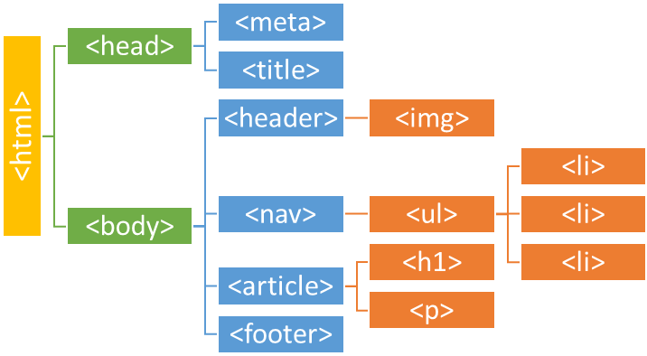
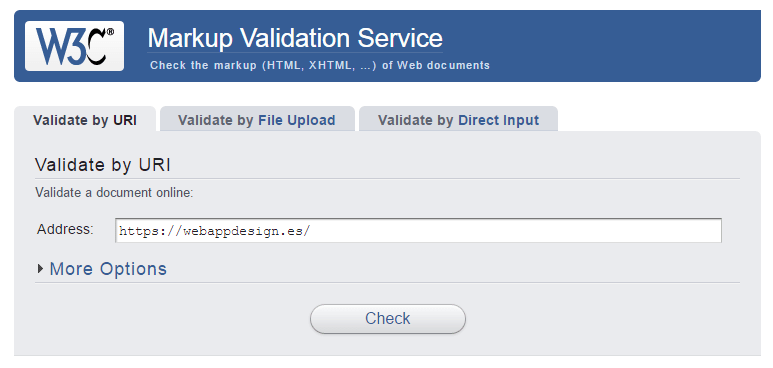

# HTML esencial

## Importancia de Html en paginas web.
El modelo de objeto de documento (DOM) es una interfaz de programación para los documentos HTML y XML. Facilita una representación estructurada del documento y define de qué manera los programas pueden acceder, al fin de modificar, tanto su estructura, estilo y contenido. El DOM da una representación del documento como un grupo de nodos y objetos estructurados que tienen propiedades y métodos. Esencialmente, conecta las páginas web a scripts o lenguajes de programación.



## Clasificación de etiquetas
### ¿Que es una etiqueta?
    Las etiquetas HTML son pequeños bloques de código, que indican al navegador como debe interpretar el contenido recogido entre dichas etiquetas.

### ETIQUETAS INICIALES O DE RAÍZ
- ``<!DOCTYPE html>`` Indica al navegador que el documento está basado en el estándar HTML5
    
- ``<html> </html>`` Representa la raíz de un documento HTML. Todos los demás elementos de la estructura HTML deben ser recogidos dentro de estas etiquetas.

### METADATOS DEL DOCUMENTO

- ``<head> </head>`` Representa una colección de metadatos acerca del documento, incluyendo enlaces a, o definiciones de, scripts y hojas de estilo. El resto de etiquetas de metadatos, irán recogidas dentro de las etiquetas de apertura y cierre del head. Importante explicar que estos metadatos del documento, es información para el navegador y no contenido que será visible en la página web.

- ``<title> </title>`` Etiqueta usada para definir el título de la página web.
- ``<link>`` Se usa para enlazar recursos externos al documento HTML. El ejemplo más común son las hojas de estilos CSS.

- ``<meta>`` Etiqueta usada para definir otros metadatos que no se pueden definir con una etiqueta HTML especifica. Por ejemplo para definir el autor del sitio, o la descripción del mismo.
- ``<style> </style>`` Etiquetas usadas para introducir código CSS en línea, es decir, en el propio documento HTML.

### ETIQUETAS DE SECCIONES O PARA ESTRUCTURAR EL HTML
- ``<body> </body>`` Al contrario que la etiqueta de metadatos ``<head>``, todo lo que quieras mostrar en la página web debe ir recogido dentro de las etiquetas de apertura y cierre de ``<body>``. Este contenido será el que se muestre en la web.
- ``<nav> </nav>`` Usadas para definir el contenido que será la sección de navegación de la web.
- ``<main> </main>`` Se usa para definir el contenido principal del documento. Solamente puede existir uno por documento.
- ``<section> </section>`` Define una sección del documento
- ``<article> </article>`` Define contenido independiente de la web.
- ``<aside> </aside>`` Dentro de estas etiquetas suele alojarse el contenido adicional de la web. Suele ser contenido relacionado con la web pero de poca importancia
- ``<h1>,<h2>,<h3>,<h4>,<h5>,<h6>`` Son etiquetas HTML muy importantes, ya que son usadas para jerarquizar el contenido de la web. Las etiquetas se usan para explicar brevemente el contenido que irá a continuación.
- ``<header> </header>`` Se usan para definir la cabecera la página web. Suele contener el logotipo, menú de navegación, etc.
- ``<footer> </footer>`` Usadas para definir el pie de página.

### ETIQUETAS PARA LA AGRUPACIÓN DE CONTENIDO
- ``<p> </p>`` Etiqueta usada para escribir párrafos de texto.
- ``<hr>`` Etiqueta utilizada para «romper» entre dos secciones de una web. Usada comúnmente como separador.
- ``<pre> </pre>`` Usada para pegar texto manteniendo el pre formato propio del texto.
- ``<blockquote> </blockquote>`` Se usan para indicar que el contenido es texto citado.
- ``<ol> </ol>`` Etiquetas para crear una lista ordenada
- ``<ul> </ul>`` Etiquetas para crear una lista des-ordenada
- ``<li> </li>`` Etiquetas que recogen el contenido de un elemento de una lista, sea ordenada o no.
- ``<dl> </dl>`` Usada para crear una lista de definiciones.
- ``<dt> </dt>`` Representa un término definido por la siguiente etiqueta ``<dd>``
- ``<dd> </dd>`` Se usa para definir los términos listados antes que él.
- ``<figure> </figure>`` Indica una figura ilustrada como parte del documento HTML5.
- ``<figcaption> </figcaption>`` Utilizada para definir la leyenda de una figura.
- ``<div> </div>`` Etiqueta común utilizada para crear un contenedor genérico.

### ETIQUETAS SEMÁNTICAS PARA TEXTO
- ``<a> </a>`` Etiqueta utilizada para crear hiperenlaces en el documento HTML
- ``<strong> </strong>`` Etiqueta para definir una palabra o conjunto de ellas como importantes. Tiene una fuerte importancia en el SEO de la página.
- ``<small> </small>`` Utilizada para dejar un comentario aparte, del tipo una nota de derechos de autoría, u otros textos que no son esenciales para la comprensión del documento.
- ``<cite> </cite>`` Para indicar el título de una obra
- ``<sub> </sub>``y ``<sup> </sup>`` Etiquetas utilizadas para representar un subíndice o superíndice.
- ``<mark> </mark>`` Usada para resaltar texto
- ``<span> </span>`` Etiqueta HTML sin ningún significado específico. Se usa conjuntamente con los atributos «class» o «id» para atribuirle ciertas características.
- ``<br>`` Etiqueta utilizada para crear un salto de línea

### ETIQUETAS PARA INCRUSTAR CONTENIDO
- ```` Etiqueta para «pintar» una imagen en la página web.
- ``<iframe> </iframe>`` Es una etiqueta que sirve para anidar otro documento HTML dentro del documento principal.
- ``<embed>`` Usada para integrar una aplicación o contenido interactivo externo que no suele ser HTML.
- ``<object> </object>`` Utilizada llamar a un recurso externo de la web. Este recurso será tratado como una imagen, o un recurso externo para ser procesado por un plugin.
- ``<video> </video>`` Se usa para reproducir video en la página web junto a sus archivos de audio y capciones asociadas.
- ``<audio> </audio>`` Usada para cargar en una web un archivo de audio o stream de audio.
- ``<source>`` Permite a autores especificar recursos multimedia alternativos para las etiquetas de ``<video>`` o ``<audio>``
- ``<svg> </svg>`` Se usa para llamar a una imagen vectorizada.

### ETIQUETAS PARA LA CREACIÓN DE TABLAS
- ``<table> </table>`` Etiquetas de apertura y cierre de una tabla. El resto de etiquetas de la tabla han de ir siempre recogidas entre estas dos etiquetas.
- ``<caption> </caption>`` Usada para indicar el título de la tabla.
- ``<colgroup> </colgroup>`` Etiqueta utilizada para agrupar dos o más columnas de una tabla.
- ``<tbody> </tbody>`` Usada para describir los datos concretos de una tabla.
- ``<thead> </thead>`` Indica el bloque de filas que describen las etiquetas de las columnas de la tabla.
- ``<tfoot> </tfoot>`` Indica los bloques de filas que describen los resúmenes, o datos totales de una columna de una tabla.
- ``<tr> </tr>`` Se usa para indicar una fila de celdas de una tabla.
- ``<td> </td>`` Usada para definir una celda de una tabla.
- ``<th> </th>`` Etiqueta que se usa para definir el encabezado de una celda
### ETIQUETAS PARA LA CREACIÓN DE FORMULARIOS
- ``<form> </form>`` Etiqueta de apertura y cierre de un formulario de una página web. El resto de etiquetas de formulario deben ir siempre recogidas entre estas etiquetas de apertura y cierre de formulario.
- ``<fieldset> </fieldset>`` Etiqueta que representa un conjunto o agrupación de elementos de un formulario. «Pinta» un recuadro alrededor de las etiquetas que estén contenidas dentro del ``<fieldset>``
- ``<legend> </legend>`` Etiqueta ligada a ``<fieldset>``. Indica el título del ``<fieldset>``
- ``<label> </label>`` Se usa para definir el nombre o título de un control del formulario.
- ``<input>`` Pinta un campo de introducción de datos para el usuario. Es de las principales etiquetas de un formulario.
- ``<button> </button>`` Etiqueta utilizada para representar un botón en el formulario.
- ``<select> </select>`` Input que permite una selección entre un conjunto de opciones.
- ``<option> </option>`` Etiqueta ligada a ``<select>``. Permite añadir diferentes opciones al ``<select>``
- ``<textarea> </textarea>`` Añade un campo al usuario para que pueda introducir texto en unas líneas máximas de texto que el desarrollador puede definir.

## ¿Qué es un atributo de una etiqueta?
Un atributo HTML es un valor o propiedad que añades a una etiqueta HTML.

[Listado de atributos](https://developer.mozilla.org/es/docs/Web/HTML/Attributes)

## Buenas Practicas en HTML

1. Declara el DOCTYPE
    
    A través de la declaración del tipo de documento, o DOCTYPE, indicamos el estándar usado al construir un documento HTML. De esta forma, los navegadores que lean esta declaración interpretarán el documento con el lenguaje y versión definidos.
    Cabe destacar que, estando en 2017, no debemos usar un DOCTYPE obsoleto, y utilizar siempre la versión recomendada de HTML, que a día de hoy es HTML5.

    Mal (por usar versiones antiguas):
    
    ``<!DOCTYPE HTML PUBLIC "-//W3C//DTD HTML 4.01//EN"``
    
    Bien (se declara el DOCTYPE de una versión actual y recomendada de HTML):

    ``<!DOCTYPE html>``


2. Cierra las etiquetas
    
    Una de las primeras cosas que se estudian cuando se está aprendiendo HTML es que las etiquetas deben cerrarse, y en el mismo orden en el que se abrieron.

    Mal:
    ```html
    <div>
        <p>Contenido
        <p>Contenido</p>
    </div>
    ```
    Bien:
    ```html
    <div>
        <p>Contenido</p>
        <p>Contenido</p>
    </div>
    ```
    Cabe destacar que en HTML5 se introdujeron las etiquetas vacías (void tags en inglés) que son un caso especial que no necesitan etiqueta de cierre.

    Dichas etiquetas son:
    ``<area>, <base>, <br>, <col>, <embed>, <hr>, , <input>, <keygen>, <link>, <menuitem>, <meta>, <param>, <source>, <track>, <wbr>``
    Puedes consultar más información sobre las etiquetas vacías en el siguiente enlace.

3. Usa minúsculas en los nombres de etiquetas, atributos y valores
    
    A pesar de no afectar al funcionamiento de la página, es una recomendación escribir siempre las etiquetas, atributos y valores en minúsculas, ya que mejora la legibilidad del código.

    Mal:
    ```html
    <SECTION>
        <h1>Título</H1>
        <P>Contenido</P>
    <section>
    ```
    Bien:
    ```html
    <section>
        <h1>Título</h1>
        <p>Contenido</p>
    <section>
    ```

4. Usa el atributo ALT en imágenes
    
    Las imágenes deben incluir siempre dicho atributo, que proporciona, como su nombre indica, un texto alternativo a la imagen. Su uso mejora la accesibilidad ya que, por ejemplo, los lectores de pantalla se basan en este atributo para proporcionar un contexto a las imágenes.

    Dicho valor debe ser lo suficientemente descriptivo al contenido. Si la imagen no tiene ninguna relevancia (como un icono, por ejemplo), es recomendable seguir incluyendo el atributo, aunque esté vacío.

    Mal:

    ```html
    
    ```
    
    Bien:
    ```html
    
    ```

5. Usa una indentación consistente
    
    Esto es aplicable a cualquier lenguaje: un código con mala indentación o sin ella carece en gran medida de legibilidad.

    Indentar es utilizar espacios a la derecha de cada línea con el objetivo de mejorar la legibilidad del código, por lo que es un aspecto importante y que deberías tener siempre en cuenta al programar.

    En el modo de hacerlo tenemos varias opciones, mediante tabulaciones (Tab) o espacios (1, 2, o los que se prefieran). Esto ya es cuestión personal (yo personalmente prefiero Tabs), aunque podríamos tomar como referencia la guía de estilos de Google que recomienda dos espacios.

    Sea como sea (con tabulaciones, dos, tres espacios,…) lo importante es que sea consistente en todo el código.

    Mal:
    ```html
    <div>
      <h1>Título</h1>
       <ul>
     <li>Elemento 1</li>
     <li>Elemento 2</li>
    <li>Elemento 3</li>
   </ul>
   </div>
   ```
    Bien:
    ```html
    <div>
        <h1>Título</h1>
            <ul>
                <li>Elemento 1</li>
                <li>Elemento 2</li>
                <li>Elemento 3</li>
            </ul>
    </div>
    ```

6. Separa el contenido de la presentación
    
    No uses estilos en línea. HTML es el contenido, y CSS proporciona la presentación visual de dicho contenido. No los mezcles.

    Al mezclarlos, se consiguen páginas más lentas, difíciles de leer y mantener. Tener el estilo y el contenido separado ayudará al equipo de desarrollo a realizar cambios y mantenimiento de una forma mucho más eficiente.

    Por ello, siempre es recomendable utilizar hojas de estilo externas, junto con clases para aplicar estilos según sea necesario.

    Mal:

    ```html
    <p style="color: red;">Información</p>
    ```
    
    Bien:

    ```html
    <p class="alerta">Información</p>
    ```

7. Usa etiquetas semánticas y evita la Divitis
    
    Se podría definir Divitis como esa mala práctica de usar divs para organizar todo el contenido de la página. Aunque funciona, empeora la legibilidad y sobrecarga el código.

    Es más recomendable mantener nuestro código lo más limpio y reducido posible, reduciendo el uso de clases e id innecesarios para vincular estilos a un solo elemento.

    Para ello, podemos utilizar los elementos estructurales de HTML5 de forma adecuada, como:

    ``<header>, <aside>, <section>, <article>, <menu>, <footer>...``
    
    Mal:
    ```html
    <div id="encabezado"></div>
        <div id="navegacion"></div>
            <div id="contenido">
                <div class="articulo"></div>
                <div class="articulo"></div>
            </div>
        <div id="pie"></div>
    ```
    
    Bien:
    ```html
    <header></header>
        <nav></nav>
        <main>
            <article></article>
            <article></article>
        </main>
    <footer></footer>
    ```

8. Omite el valor de atributos booleanos
    
    Existen atributos en HTML conocidos como atributos booleanos. Según el estándar, y a pesar de lo que pueda parecer, estos atributos no admiten los valores true o false, se representan incluyendo (true) u omitiendo (false) su nombre.

    Son ejemplos de atributos booleanos:

    checked, selected, disabled, readonly...
    Es por ello, que debemos usarlos correctamente y omitir siempre su valor.

    Mal:

    ```html
    <input type="checkbox" name="ejemplo" checked="checked">
    ```
    Bien:
    ```html
    <input type="checkbox" name="ejemplo" checked>
    ```

9. Especifica la codificación de caracteres
    
    También de las más conocidas, especificar correctamente la codificación de caracteres nos permitirá la correcta visualización del contenido de nuestra página, incluyendo tildes y caracteres especiales como ñ, indicando al navegador cómo debe interpretarlos.

    Para especificarla, debemos añadir la siguiente línea al header de la página:

    ```html
    <meta charset="UTF-8"/>```
    En este caso indicamos como sistema de codificación UTF-8 al ser el más extendido y usado.

10. Valida tu código
    
    Cuando Validamos nuestro  código comprobamos que cumple con los estándares. Y qué mejor forma para validarlo que usando la herramienta realizada por la misma organización que establece dichos estándares: W3C.

    Hay que tener en cuenta que no nos debemos obsesionar con el resultado, ya que no obtener la validación completa no quiere decir siempre que sea un mal código. Podéis comprobar el resultado de la validación de páginas como Google, Twitter o incluso GitHub para daros cuenta que tampoco son sitios perfectos.



Enlace del servicio de validación:
[enlace](https://validator.w3.org/)


## Referencia
Enlace de documentación recomendada:
[enlace](https://developer.mozilla.org/es/docs/Learn/Getting_started_with_the_web/HTML_basics "Docs Mozilla Developer")